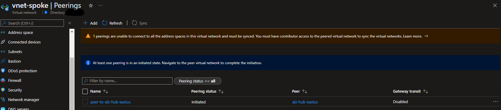

# Module: VNet Peering

This module creates a virtual network peering connection between two virtual networks and is to be utilized by other modules. Module will need to be called twice to create the completed peering.  Each time with a peering direction. This allows for peering between different subscriptions.  

**Peering Options Documentation:**

- [https://docs.microsoft.com/en-us/azure/virtual-network/virtual-network-manage-peering](https://docs.microsoft.com/en-us/azure/virtual-network/virtual-network-manage-peering)
- [https://docs.microsoft.com/en-us/azure/virtual-network/virtual-network-manage-peering#create-a-peering](https://docs.microsoft.com/en-us/azure/virtual-network/virtual-network-manage-peering#create-a-peering)

Module deploys the following resources:

- Virtual Network Peering

> Consider using the `hubPeeredSpoke` orchestration module instead to simplify spoke networking deployment, VNET Peering, UDR configuration and Subscription placement in a single module. [infra-as-code/bicep/orchestration/hubPeeredSpoke](https://github.com/Azure/ALZ-Bicep/tree/main/infra-as-code/bicep/orchestration/hubPeeredSpoke)

## Parameters

The module requires the following inputs:

 | Parameter                        | Type   | Default | Description                                                     | Requirement                                  | Example         |
 | -------------------------------- | ------ | ------- | --------------------------------------------------------------- | -------------------------------------------- | --------------- |
 | parDestinationVirtualNetworkId   | string | None    | ID of the Destination Virtual Network                           | Valid Virtual Network ID                     |
 | parSourceVirtualNetworkName      | string | None    | Name of Source Virtual Network                                  | Valid Azure Region                           | alz-spk-eastus2 |
 | parDestinationVirtualNetworkName | string | None    | Virtual Network Name of the destination/target Virtual Network. | 2-64 char, letters, numbers, and underscores | alz-hub-eastus2 |
 | parAllowVirtualNetworkAccess     | bool   | true    | Switch to enable virtual Network Access                         | None                                         | true            |
 | parAllowForwardedTraffic         | bool   | true    | Switch to enable Forwarded Traffic                              | None                                         | true            |
 | parAllowGatewayTransit           | bool   | false   | Switch to enable Gateway Transit                                | None                                         | false           |
 | parUseRemoteGateways             | bool   | false   | Switch to enable Remote Gateway                                 | None                                         | false           |
 | parTelemetryOptOut               | bool   | false   | Set Parameter to true to Opt-out of deployment telemetry        | None                                         | false           |

## Outputs

The module will generate the following outputs:

| Output | Type | Example |
| ------ | ---- | ------- |

## Deployment

In this example, the remote spoke VNet will be peered with the Hub VNet in the Connectivity subscription.

> Note that the example configures the peering only one way, to complete the peering you will need to repeat the process with a separate parameter file with reverse parameters.

During the deployment step, we will take parameters provided in the example parameters file.

 | Azure Cloud    | Bicep template      | Input parameters file                    |
 | -------------- | ------------------- | ---------------------------------------- |
 | All  regions | vnetPeering.bicep | parameters/vnetPeering.parameters.all.json    |

> For the examples below we assume you have downloaded or cloned the Git repo as-is and are in the root of the repository as your selected directory in your terminal of choice.

### Azure CLI
```bash
# For Azure global regions
# Set your Corp Connected Landing Zone subscription ID as the the current subscription 
LandingZoneSubscriptionId="[your Landing Zone subscription ID]"
az account set --subscription $LandingZoneSubscriptionId

az deployment group create \
   --resource-group Spoke_Networking_POC  \
   --template-file infra-as-code/bicep/modules/vnetPeering/vnetPeering.bicep \
   --parameters @infra-as-code/bicep/modules/vnetPeering/parameters/vnetPeering.parameters.all.json
```
OR
```bash
# For Azure China regions
# Set your Corp Connected Landing Zone subscription ID as the the current subscription 
LandingZoneSubscriptionId="[your Landing Zone subscription ID]"
az account set --subscription $LandingZoneSubscriptionId

az deployment group create \
    --resource-group Spoke_Networking_POC  \
   --template-file infra-as-code/bicep/modules/vnetPeering/vnetPeering.bicep \
   --parameters @infra-as-code/bicep/modules/vnetPeering/parameters/vnetPeering.parameters.all.json
```

### PowerShell

```powershell
# For Azure global regions
# Set your Corp Connected Landing Zone subscription ID as the the current subscription 
$LandingZoneSubscriptionId = "[your Landing Zone subscription ID]"

Select-AzSubscription -SubscriptionId $LandingZoneSubscriptionId

New-AzResourceGroupDeployment `
  -ResourceGroupName Spoke_Networking_POC `
  -TemplateFile infra-as-code/bicep/modules/vnetPeering/vnetPeering.bicep `
  -TemplateParameterFile infra-as-code/bicep/modules/vnetPeering/parameters/vnetPeering.parameters.all.json
```
OR
```powershell
# For Azure China regions
# Set your Corp Connected Landing Zone subscription ID as the the current subscription 
$LandingZoneSubscriptionId = "[your Landing Zone subscription ID]"

Select-AzSubscription -SubscriptionId $LandingZoneSubscriptionId

New-AzResourceGroupDeployment `
  -ResourceGroupName Spoke_Networking_POC `
  -TemplateFile infra-as-code/bicep/modules/vnetPeering/vnetPeering.bicep `
  -TemplateParameterFile infra-as-code/bicep/modules/vnetPeering/parameters/vnetPeering.parameters.all.json
```

## Example output in Azure global regions



## Bicep Visualizer


