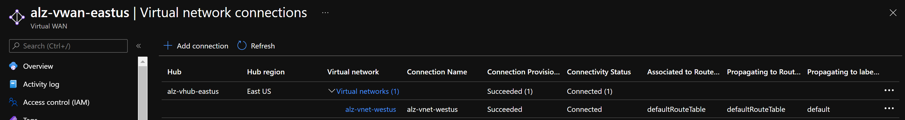
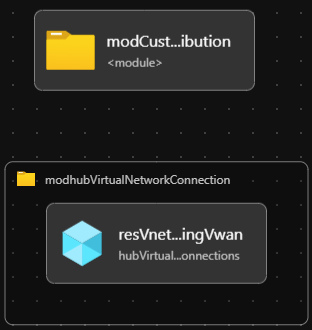

# Module:  VNet Peering with vWAN

This module is used to perform virtual network peering with the Virtual WAN virtual hub. This network topology is based on the Azure Landing Zone conceptual architecture which can be found [here](https://docs.microsoft.com/en-us/azure/cloud-adoption-framework/ready/azure-best-practices/virtual-wan-network-topology) and the hub-spoke network topology with Virtual WAN [here](https://docs.microsoft.com/en-us/azure/architecture/networking/hub-spoke-vwan-architecture). Once peered, virtual networks exchange traffic by using the Azure backbone network. Virtual WAN enables transitivity among hubs which is not possible solely by using peering. This module draws parity with the Enterprise Scale implementation in the ARM template [here](https://github.com/Azure/Enterprise-Scale/blob/main/eslzArm/subscriptionTemplates/vnetPeeringVwan.json).

Module deploys the following resources which can be configured by parameters:

- Virtual network peering with Virtual WAN virtual hub

> Consider using the `hubPeeredSpoke` orchestration module instead to simplify spoke networking deployment, VNET Connection to VWAN Hub (Peering), UDR configuration and Subscription placement in a single module. [infra-as-code/bicep/orchestration/hubPeeredSpoke](https://github.com/Azure/ALZ-Bicep/tree/main/infra-as-code/bicep/orchestration/hubPeeredSpoke)

## Parameters

The module requires the following inputs:

 | Parameter                    | Type   | Default                                                                                              | Description                                                                                                                                                                                                                                                         | Requirement                   | Example                      |
 | ---------------------------- | ------ | ---------------------------------------------------------------------------------------------------- | ------------------------------------------------------------------------------------------------------------------------------------------------------------------------------------------------------------------------------------------------------------------- | ----------------------------- | ---------------------------- |
 | parVirtualWanHubResourceId        | string | None                                               | Resource ID for Virtual WAN Hub.                                                                                                                                                                                          | 2-50 char                     | `/subscriptions/xxxxxxxx-xxxx-xxxx-xxxx-xxxxxxxxxxxx/resourceGroups/alz-vwan-eastus/providers/Microsoft.Network/virtualHubs/alz-vhub-eastus`              |
| parRemoteVirtualNetworkResourceId        | string | None                                                 | Resource ID for remote spoke virtual network.                                                                                                                                                                                          | 2-50 char                     | `/subscriptions/xxxxxxxx-xxxx-xxxx-xxxx-xxxxxxxxxxxx/resourceGroups/spokevnet-rg/providers/Microsoft.Network/virtualNetworks/vnet-spoke`              |
 | parTelemetryOptOut           | bool   | `false`                                                                                                | Set Parameter to true to Opt-out of deployment telemetry                                                                                                                                                                                                            | None                          | `false`                        |

## Outputs

The module will generate the following outputs:

| Output                    | Type   | Example                                                                                                                                                                                                  |
| ------------------------- | ------ | -------------------------------------------------------------------------------------------------------------------------------------------------------------------------------------------------------- |
| outHubVirtualNetworkConnectionName | string | `alz-vhub-eastus/vnet-spoke-vhc`                                                                                                                                                                                            |
| outHubVirtualNetworkConnectionResourceId      | string | `/subscriptions/xxxxxxxx-xxxx-xxxx-xxxx-xxxxxxxxxxxx/resourceGroups/alz-vwan-eastus/providers/Microsoft.Network/virtualHubs/alz-vhub-eastus/hubVirtualNetworkConnections/vnet-spoke-vhc`                                                                                                                                                                                          |

## Deployment

In this example, the remote spoke Vnet will be peered with the Vwan Virtual Hub in the Connectivity subscription. During the deployment step, we will take parameters provided in the example parameters file.

 | Azure Cloud    | Bicep template      | Input parameters file                    |
 | -------------- | ------------------- | ---------------------------------------- |
 | All  regions | vnetPeeringVwan.bicep | parameters/vnetPeeringVwan.parameters.all.json    |

> For the examples below we assume you have downloaded or cloned the Git repo as-is and are in the root of the repository as your selected directory in your terminal of choice.

### Azure CLI
```bash
# For Azure global regions
# Set your Corp Connected Landing Zone subscription ID as the the current subscription 
$ConnectivitySubscriptionId="[your Landing Zone subscription ID]"
az account set --subscription $ConnectivitySubscriptionId

az deployment sub create \
   --template-file infra-as-code/bicep/modules/vnetPeeringVwan/vnetPeeringVwan.bicep \
   --parameters @infra-as-code/bicep/modules/vnetPeeringVwan/parameters/vnetPeeringVwan.parameters.all.json \
   --location eastus
```
OR
```bash
# For Azure China regions
# Set your Corp Connected Landing Zone subscription ID as the the current subscription 
$ConnectivitySubscriptionId="[your Landing Zone subscription ID]"
az account set --subscription $ConnectivitySubscriptionId

az deployment sub create \
   --template-file infra-as-code/bicep/modules/vnetPeeringVwan/vnetPeeringVwan.bicep \
   --parameters @infra-as-code/bicep/modules/vnetPeeringVwan/parameters/vnetPeeringVwan.parameters.all.json \
   --location chinaeast2
```

### PowerShell

```powershell
# For Azure global regions
# Set your Corp Connected Landing Zone subscription ID as the the current subscription 
$ConnectivitySubscriptionId = "[your Landing Zone subscription ID]"

Select-AzSubscription -SubscriptionId $ConnectivitySubscriptionId

New-AzDeployment `
  -TemplateFile infra-as-code/bicep/modules/vnetPeeringVwan/vnetPeeringVwan.bicep `
  -TemplateParameterFile infra-as-code/bicep/modules/vnetPeeringVwan/parameters/vnetPeeringVwan.parameters.all.json `
  -Location 'eastus'
```
OR
```powershell
# For Azure China regions
# Set your Corp Connected Landing Zone subscription ID as the the current subscription 
$ConnectivitySubscriptionId = "[your Landing Zone subscription ID]"

Select-AzSubscription -SubscriptionId $ConnectivitySubscriptionId

New-AzDeployment `
  -TemplateFile infra-as-code/bicep/modules/vnetPeeringVwan/vnetPeeringVwan.bicep `
  -TemplateParameterFile infra-as-code/bicep/modules/vnetPeeringVwan/parameters/vnetPeeringVwan.parameters.all.json `
  -Location 'chinaeast2'
```
## Example Output in Azure global regions



## Bicep Visualizer


