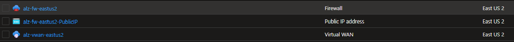
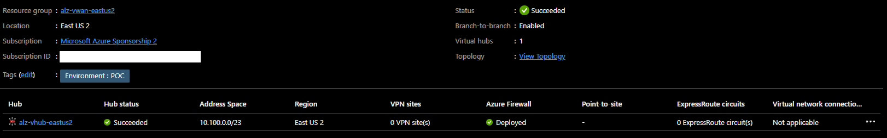
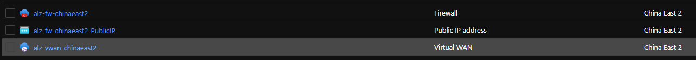
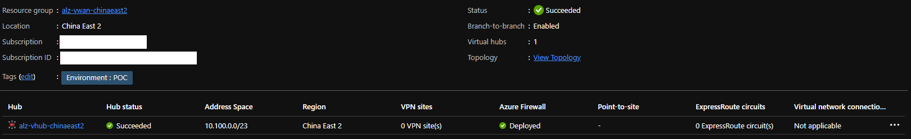
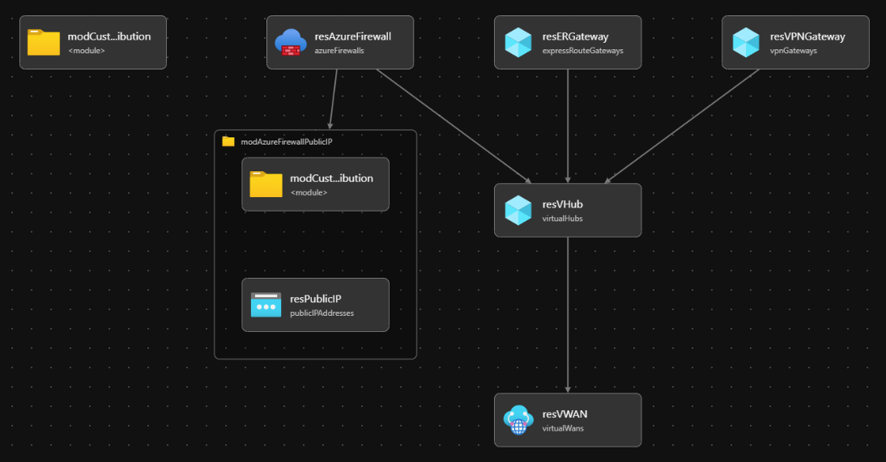

# Module:  Virtual WAN

This module is used to deploy the Virtual WAN network topology and its components according to the Azure Landing Zone conceptual architecture which can be found [here](https://docs.microsoft.com/en-us/azure/cloud-adoption-framework/ready/azure-best-practices/virtual-wan-network-topology). This module draws parity with the Enterprise Scale implementation in the ARM template [here](https://github.com/Azure/Enterprise-Scale/blob/main/eslzArm/subscriptionTemplates/vwan-connectivity.json).

Module deploys the following resources which can be configured by parameters:

- Virtual WAN
- Virtual Hub. The virtual hub is a prerequisite to connect to either a VPN Gateway, an ExpressRoute Gateway or an Azure Firewall to the virtual WAN
- VPN Gateway
- ExpressRoute Gateway
- Public IP is deployed only if Azure Firewall is enabled
- Azure Firewall
- Azure Firewall policy

## Parameters

The module requires the following inputs:

 | Parameter                    | Type   | Default                                                                                              | Description                                                                                                                                                                                                                                                         | Requirement                   | Example                      |
 | ---------------------------- | ------ | ---------------------------------------------------------------------------------------------------- | ------------------------------------------------------------------------------------------------------------------------------------------------------------------------------------------------------------------------------------------------------------------- | ----------------------------- | ---------------------------- |
 | parVirtualHubEnabled            | bool   | true                                                                                                 | Switch to enable deployment of Virtual Hub                                                                                                                                                                                                                         | None                          | true                         |
 | parVPNGatewayEnabled               | bool   | true                                                                                                 | Switch to enable deployment of VPN Gateway service                                                                                                                                                                                        | Virtual Hub                          | true                         |
 | parERGatewayEnabled      | bool   | true                                                                                                 | Switch to enable deployment of ExpressRoute Gateway                                                                                                                                                                                                                          | Virtual Hub                          | true                         |
 | parAzureFirewallEnabled    | bool   | true                                                                                                 | Switch to enable deployment of Azure Firewall                                                                                                                                                                                                              | Virtual Hub                          | true                         |
 | parNetworkDNSEnableProxy    | bool   | true                                                                                                 | Switch to enable DNS proxy for Azure Firewall policies                                                                                                                                                                                                              | Azure Firewall                          | true                         |
 | parCompanyPrefix             | string | alz                                                                                                  | Prefix value which will be pre-appended to all resource names                                                                                                                                                                                                       | 1-10 char                     | alz                          |
 | parPublicIPSku               | string | Standard                                                                                             | SKU or Tier of Public IP to deploy                                                                                                                                                                                                                                  | Standard or Basic             | Standard                     |
 | parTags                      | object | Empty Array []                                                                                       | List of tags (Key Value Pairs) to be applied to resources                                                                                                                                                                                                           | None                          | environment: 'POC'   |
 | parVhubAddressPrefix   | string | 10.100.0.0/23                                                                                         | CIDR range for the Virtual WAN's Virtual Hub Network                                                                                                                                                                                                                                          | CIDR Notation                 | 10.100.0.0/23                 |
 | parAzureFirewallTier         | string | Standard                                                                                             | Tier associated with the Firewall to be deployed.                                                                                                                                                                                                                   | Standard or Premium           | Standard                      |
 | parVWanName            | string | ${parCompanyPrefix}-vwan-${resourceGroup().location}                                                  | Name prefix for Virtual WAN.  Prefix will be appended with the region.                                                                                                                                                                                          | 2-50 char                     | alz-vwan-eastus              |
 | parVHubName            | string | ${parCompanyPrefix}-vhub-${resourceGroup().location}                                                  | Name prefix for Virtual Hub.  Prefix will be appended with the region.                                                                                                                                                                                          | 2-50 char                     | alz-vhub-eastus              |
 | parVPNGwName            | string | ${parCompanyPrefix}-vpngw-${resourceGroup().location}                                                  | Name prefix for VPN Gateway.  Prefix will be appended with the region.                                                                                                                                                                                          | 2-50 char                     | alz-vpngw-eastus              |
 | parERGwName            | string | ${parCompanyPrefix}-ergw-${resourceGroup().location}                                                  | Name prefix for ExpressRoute Gateway.  Prefix will be appended with the region.                                                                                                                                                                                          | 2-50 char                     | alz-ergw-eastus              |
  | parAzureFirewallName         | string | ${parCompanyPrefix}-fw-${resourceGroup().location}                                             | Name associated with Azure Firewall                                                                                                                                                                                                                                  | 1-80 char                     | alz-fw-eastus           |
  | parFirewallPoliciesName         | string | ${parCompanyPrefix}-azfwpolicy-${resourceGroup().location}                                             | Name associated with Azure Firewall                                                                                                                                                                                                                                  | 1-80 char                     | alz-azfwpolicy-eastus           |
  | parLocation                    | string | `resourceGroup().location` | The Azure Region to deploy the resources into                       | None        | `eastus`                                                                                                                                              |
  | parVPNGwScaleUnit         | int | 1                                                                   | The scale unit for the VPN Gateway                                                                                                                                                                                                                | None                     | 1           |
 | parERGwScaleUnit         | int | 1                                                                   | The scale unit for the ExpressRoute Gateway                                                                                                                                                                                                                | None                     | 1           |
 | parTelemetryOptOut           | bool   | false                                                                                                | Set Parameter to true to Opt-out of deployment telemetry                                                                                                                                                                                                            | None                          | false                        |

## Outputs

The module will generate the following outputs:

| Output                    | Type   | Example                                                                                                                                                                                                  |
| ------------------------- | ------ | -------------------------------------------------------------------------------------------------------------------------------------------------------------------------------------------------------- |
| outVirtualWANName | string | alz-vwan-eastus                                                                                                                                                                                            |
| outVirtualWANID      | string | /subscriptions/xxxxxxxx-xxxx-xxxx-xxxx-xxxxxxxxxxxx/resourceGroups/alz-vwan-eastus/providers/Microsoft.Network/virtualWans/alz-vwan-eastus                                                                                                                                                                                          |
| outVirtualHubName | string | alz-vhub-eastus                                                                                                                                                                                            |
| outVirtualHubID      | string | /subscriptions/xxxxxxxx-xxxx-xxxx-xxxx-xxxxxxxxxxxx/resourceGroups/alz-vwan-eastus/providers/Microsoft.Network/virtualHubs/alz-vhub-eastus                                                                                                                                                                                          |
## Deployment

In this example, the resources required for Virtual WAN connectivity will be deployed to the resource group specified. According to the Azure Landing Zone Conceptual Architecture, the Virtual WAN resources should be deployed into the Platform connectivity subscription. During the deployment step, we will take parameters provided in the example parameters file.

 | Azure Cloud    | Bicep template      | Input parameters file                    |
 | -------------- | ------------------- | ---------------------------------------- |
 | All  regions | vwanConnectivity.bicep | vwanConnectivity.bicep.parameters.example.json    |

> For the examples below we assume you have downloaded or cloned the Git repo as-is and are in the root of the repository as your selected directory in your terminal of choice.

### Azure CLI
```bash
# For Azure global regions
# Set Platform connectivity subscription ID as the the current subscription 
ConnectivitySubscriptionId="[your platform management subscription ID]"
az account set --subscription $ConnectivitySubscriptionId

az group create --location eastus \
   --name alz-vwan-eastus

az deployment group create \
   --resource-group alz-vwan-eastus \
   --template-file infra-as-code/bicep/modules/vwanConnectivity/vwanConnectivity.bicep \
   --parameters @infra-as-code/bicep/modules/vwanConnectivity/vwanConnectivity.parameters.example.json
```
OR
```bash
# For Azure China regions
# Set Platform connectivity subscription ID as the the current subscription 
ConnectivitySubscriptionId="[your platform management subscription ID]"
az account set --subscription $ConnectivitySubscriptionId

az group create --location chinaeast2 \
   --name alz-vwan-chinaeast2

az deployment group create \
   --resource-group alz-vwan-chinaeast2 \
   --template-file infra-as-code/bicep/modules/vwanConnectivity/vwanConnectivity.bicep \
   --parameters @infra-as-code/bicep/modules/vwanConnectivity/vwanConnectivity.parameters.example.json
```

### PowerShell

```powershell
# For Azure global regions
# Set Platform connectivity subscription ID as the the current subscription 
$ConnectivitySubscriptionId = "[your platform management subscription ID]"

Select-AzSubscription -SubscriptionId $ConnectivitySubscriptionId

New-AzResourceGroup -Name 'alz-vwan-eastus' `
  -Location 'EastUs'
  
New-AzResourceGroupDeployment `
  -TemplateFile infra-as-code/bicep/modules/vwanConnectivity/vwanConnectivity.bicep `
  -TemplateParameterFile infra-as-code/bicep/modules/vwanConnectivity/vwanConnectivity.parameters.example.json `
  -ResourceGroupName 'alz-vwan-eastus'
```
OR
```powershell
# For Azure China regions
# Set Platform connectivity subscription ID as the the current subscription 
$ConnectivitySubscriptionId = "[your platform management subscription ID]"

Select-AzSubscription -SubscriptionId $ConnectivitySubscriptionId

New-AzResourceGroup -Name 'alz-vwan-chinaeast2' `
  -Location 'chinaeast2'
  
New-AzResourceGroupDeployment `
  -TemplateFile infra-as-code/bicep/modules/vwanConnectivity/vwanConnectivity.bicep `
  -TemplateParameterFile infra-as-code/bicep/modules/vwanConnectivity/vwanConnectivity.parameters.example.json `
  -ResourceGroupName 'alz-vwan-chinaeast2'
```
## Example Output in Azure global regions





## Example Output in Azure China regions




## Bicep Visualizer


