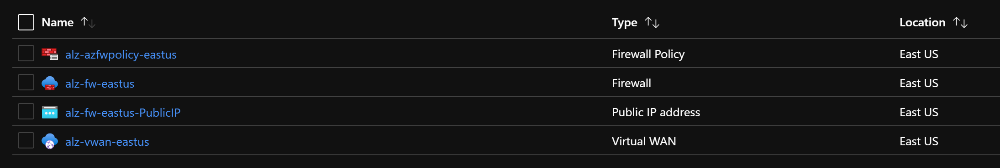
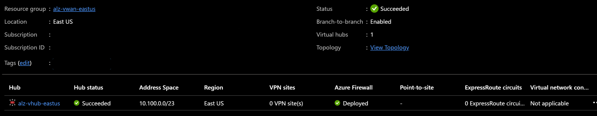
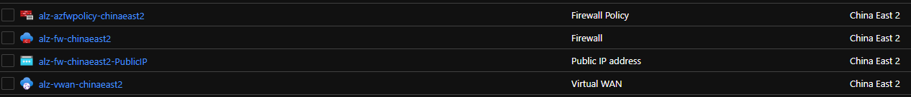
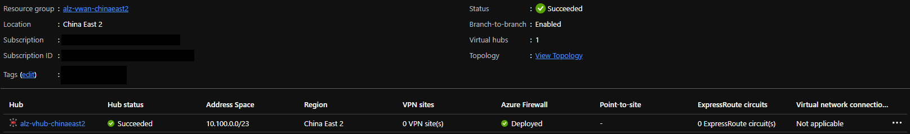
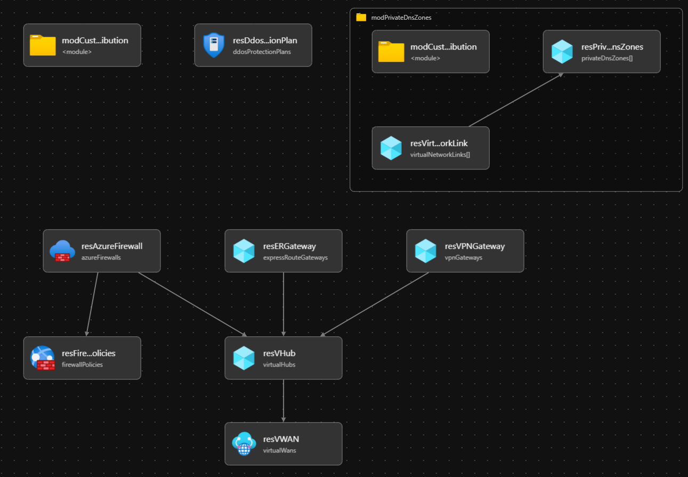

# Module:  Virtual WAN

This module is used to deploy the Virtual WAN network topology and its components according to the Azure Landing Zone conceptual architecture which can be found [here](https://docs.microsoft.com/en-us/azure/cloud-adoption-framework/ready/azure-best-practices/virtual-wan-network-topology). This module draws parity with the Enterprise Scale implementation in the ARM template [here](https://github.com/Azure/Enterprise-Scale/blob/main/eslzArm/subscriptionTemplates/vwan-connectivity.json).

Module deploys the following resources which can be configured by parameters:

- Virtual WAN
- Virtual Hub. The virtual hub is a prerequisite to connect to either a VPN Gateway, an ExpressRoute Gateway or an Azure Firewall to the virtual WAN
- VPN Gateway
- ExpressRoute Gateway
- Azure Firewall
- Azure Firewall policy
- DDoS Standard Plan
- Private DNS Zones - Details of all the Azure Private DNS zones can be found here --> [https://docs.microsoft.com/en-us/azure/private-link/private-endpoint-dns#azure-services-dns-zone-configuration](https://docs.microsoft.com/en-us/azure/private-link/private-endpoint-dns#azure-services-dns-zone-configuration)

## Parameters

The module requires the following inputs:

 | Parameter                         | Type   | Default                                                                                                            | Description                                                                                                                                                                                                                                                                                                                                                                                                                                                                                                                                 | Requirement                                      | Example                                                                                                                                  |
 | --------------------------------- | ------ | ------------------------------------------------------------------------------------------------------------------ | ------------------------------------------------------------------------------------------------------------------------------------------------------------------------------------------------------------------------------------------------------------------------------------------------------------------------------------------------------------------------------------------------------------------------------------------------------------------------------------------------------------------------------------------- | ------------------------------------------------ | ---------------------------------------------------------------------------------------------------------------------------------------- |
 | parLocation                       | string | `resourceGroup().location`                                                                                         | The Azure Region to deploy the resources into                                                                                                                                                                                                                                                                                                                                                                                                                                                                                               | None                                             | `eastus`                                                                                                                                 |
 | parVirtualHubEnabled              | bool   | true                                                                                                               | Switch to enable deployment of Virtual Hub                                                                                                                                                                                                                                                                                                                                                                                                                                                                                                  | None                                             | true                                                                                                                                     |
 | parVpnGatewayEnabled              | bool   | true                                                                                                               | Switch to enable deployment of VPN Gateway service                                                                                                                                                                                                                                                                                                                                                                                                                                                                                          | Virtual Hub                                      | true                                                                                                                                     |
 | parExpressRouteGatewayEnabled               | bool   | true                                                                                                               | Switch to enable deployment of ExpressRoute Gateway                                                                                                                                                                                                                                                                                                                                                                                                                                                                                         | Virtual Hub                                      | true                                                                                                                                     |
 | parAzFirewallEnabled           | bool   | true                                                                                                               | Switch to enable deployment of Azure Firewall                                                                                                                                                                                                                                                                                                                                                                                                                                                                                               | Virtual Hub                                      | true                                                                                                                                     |
 | parAzFirewallDnsProxyEnabled          | bool   | true                                                                                                               | Switch to enable DNS proxy for Azure Firewall policies                                                                                                                                                                                                                                                                                                                                                                                                                                                                                      | Azure Firewall                                   | true                                                                                                                                     |
 | parDdosEnabled                    | bool   | true                                                                                                               | Switch to enable deployment of distributed denial of service attacks service                                                                                                                                                                                                                                                                                                                                                                                                                                                                | None                                             | true                                                                                                                                     |
 | parPrivateDnsZonesEnabled         | bool   | true                                                                                                               | Switch to enable deployment of Azure Private DNS Zones                                                                                                                                                                                                                                                                                                                                                                                                                                                                                      | None                                             | true                                                                                                                                     |
 | parPrivateDnsZonesResourceGroup   | string | `resourceGroup().name`                                                                                             | Target Resource Group Name for Azure Private DNS Zones                                                                                                                                                                                                                                                                                                                                                                                                                                                                                      | 1-90 char                                        | `Hub_PrivateDNS_POC` - Must already be present                                                                                           |
 | parPrivateDnsZones                | array  | See example parameters file [`parameters/vwanConnectivity.parameters.all.json`](parameters/vwanConnectivity.parameters.all.json) | Array of DNS Zones to provision in Hub Virtual Network. Default: All known Azure Private DNS Zones except for: `privatelink.batch.azure.com`, `privatelink.azmk8s.io` and `privatelink.siterecovery.windowsazure.com` as these are region specific and `privatelink.{dnsPrefix}.database.windows.net` as the DNS Prefix is individual, which you can add to the parameters file with the required region and DNS Prefix in the zone name that you wish to deploy for. For more details on private DNS Zones please refer to the above link. | None                                             | See Default                                                                                                                              |
 | parVirtualNetworkIdToLink         | string | Empty String `''`                                                                                                  | Resource ID of VNet for Private DNS Zone VNet Links                                                                                                                                                                                                                                                                                                                                                                                                                                                                                         | None or Valid Resource ID of the Virtual Network | `/subscriptions/xxxxxxxx-xxxx-xxxx-xxxx-xxxxxxxxxxxx/resourceGroups/xxxxxxxxxxx/providers/Microsoft.Network/virtualNetworks/xxxxxxxxxxx` |
 | parCompanyPrefix                  | string | alz                                                                                                                | Prefix value which will be pre-appended to all resource names                                                                                                                                                                                                                                                                                                                                                                                                                                                                               | 1-10 char                                        | alz                                                                                                                                      |
 | parTags                           | object | Empty Array []                                                                                                     | List of tags (Key Value Pairs) to be applied to resources                                                                                                                                                                                                                                                                                                                                                                                                                                                                                   | None                                             | environment: 'POC'                                                                                                                       |
 | parVirtualHubAddressPrefix              | string | 10.100.0.0/23                                                                                                      | CIDR range for the Virtual WAN's Virtual Hub Network                                                                                                                                                                                                                                                                                                                                                                                                                                                                                        | CIDR Notation                                    | 10.100.0.0/23                                                                                                                            |
 | parAzFirewallTier              | string | Standard                                                                                                           | Tier associated with the Firewall to be deployed.                                                                                                                                                                                                                                                                                                                                                                                                                                                                                           | Standard or Premium                              | Standard                                                                                                                                 |
 | parVirtualWanName                       | string | `${parCompanyPrefix}-vwan-${resourceGroup().location}`                                                               | Name prefix for Virtual WAN.  Prefix will be appended with the region.                                                                                                                                                                                                                                                                                                                                                                                                                                                                      | 2-50 char                                        | alz-vwan-eastus                                                                                                                          |
 | parVirtualWanHubName                       | string | `${parCompanyPrefix}-vhub-${resourceGroup().location}`                                                               | Name prefix for Virtual Hub.  Prefix will be appended with the region.                                                                                                                                                                                                                                                                                                                                                                                                                                                                      | 2-50 char                                        | alz-vhub-eastus                                                                                                                          |
 | parVpnGatewayName                      | string | `${parCompanyPrefix}-vpngw-${resourceGroup().location}`                                                              | Name prefix for VPN Gateway.  Prefix will be appended with the region.                                                                                                                                                                                                                                                                                                                                                                                                                                                                      | 2-50 char                                        | alz-vpngw-eastus                                                                                                                         |
 | parExpressRouteGatewayName                       | string | `${parCompanyPrefix}-ergw-${resourceGroup().location}`                                                               | Name prefix for ExpressRoute Gateway.  Prefix will be appended with the region.                                                                                                                                                                                                                                                                                                                                                                                                                                                             | 2-50 char                                        | alz-ergw-eastus                                                                                                                          |
 | parAzFirewallName              | string | `${parCompanyPrefix}-fw-${resourceGroup().location}`                                                                 | Name associated with Azure Firewall                                                                                                                                                                                                                                                                                                                                                                                                                                                                                                         | 1-80 char                                        | alz-fw-eastus                                                                                                                            |
 | parAzFirewallPoliciesName           | string | `${parCompanyPrefix}-azfwpolicy-${resourceGroup().location}`                                                         | Name associated with Azure Firewall Policy                                                                                                                                                                                                                                                                                                                                                                                                                                                                                                  | 1-80 char                                        | alz-azfwpolicy-eastus                                                                                                                    |
 | parAzFirewallAvailabilityZones | array  | Empty Array []                                                                                                     | Availability Zones to deploy the Azure Firewall across. Region must support Availability Zones to use. If it does not then leave empty.                                                                                                                                                                                                                                                                                                                                                                                                     | None                                             | `['1']` or `['1' ,'2', '3']`                                                                                                             |
 | parDdosPlanName                   | string | `${parCompanyPrefix}-ddos-plan`                                                                                      | Name which will be associated with distributed denial of service protection plan                                                                                                                                                                                                                                                                                                                                                                                                                                                            | 1-80 char                                        | alz-ddos-plan                                                                                                                            |
 | parVpnGatewayScaleUnit                 | int    | 1                                                                                                                  | The scale unit for the VPN Gateway                                                                                                                                                                                                                                                                                                                                                                                                                                                                                                          | None                                             | 1                                                                                                                                        |
 | parExpressRouteGatewayScaleUnit                  | int    | 1                                                                                                                  | The scale unit for the ExpressRoute Gateway                                                                                                                                                                                                                                                                                                                                                                                                                                                                                                 | None                                             | 1                                                                                                                                        |
 | parTelemetryOptOut                | bool   | false                                                                                                              | Set Parameter to true to Opt-out of deployment telemetry                                                                                                                                                                                                                                                                                                                                                                                                                                                                                    | None                                             | false                                                                                                                                    |

> NOTE: When deploying using the `parameters/vwanConnectivity.parameters.all.json` you must update the `parPrivateDnsZones` parameter by replacing the `xxxxxx` placeholders with the deployment region. Failure to do so will cause these services to be unreachable over private endpoints.
> For example, if deploying to East US the following zone entries:
> - `privatelink.xxxxxx.azmk8s.io`
> - `privatelink.xxxxxx.backup.windowsazure.com`
> - `privatelink.xxxxxx.batch.azure.com`
>
> Will become:
> - `privatelink.eastus.azmk8s.io`
> - `privatelink.eastus.backup.windowsazure.com`
> - `privatelink.eastus.batch.azure.com`

## Outputs

The module will generate the following outputs:

| Output                | Type   | Example                                                                                                                                                                                                  |
| --------------------- | ------ | -------------------------------------------------------------------------------------------------------------------------------------------------------------------------------------------------------- |
| outVirtualWanName     | string | alz-vwan-eastus                                                                                                                                                                                          |
| outVirtualWanId       | string | /subscriptions/xxxxxxxx-xxxx-xxxx-xxxx-xxxxxxxxxxxx/resourceGroups/alz-vwan-eastus/providers/Microsoft.Network/virtualWans/alz-vwan-eastus                                                               |
| outVirtualHubName     | string | alz-vhub-eastus                                                                                                                                                                                          |
| outVirtualHubId       | string | /subscriptions/xxxxxxxx-xxxx-xxxx-xxxx-xxxxxxxxxxxx/resourceGroups/alz-vwan-eastus/providers/Microsoft.Network/virtualHubs/alz-vhub-eastus                                                               |
| outDdosPlanResourceId | string | /subscriptions/xxxxxxxx-xxxx-xxxx-xxxx-xxxxxxxxxxxx/resourceGroups/alz-vwan-eastus/providers/Microsoft.Network/ddosProtectionPlans/alz-ddos-plan                                                         |
| outPrivateDnsZones    | array  | `["name": "privatelink.azurecr.io", "id": "/subscriptions/xxxxxxxx-xxxx-xxxx-xxxx-xxxxxxxxxxxx/resourceGroups/net-lz-spk-eastus-rg/providers/Microsoft.Network/privateDnsZones/privatelink.azurecr.io"]` |
## Deployment

In this example, the resources required for Virtual WAN connectivity will be deployed to the resource group specified. According to the Azure Landing Zone Conceptual Architecture, the Virtual WAN resources should be deployed into the Platform connectivity subscription. During the deployment step, we will take parameters provided in the example parameters file.

 | Azure Cloud    | Bicep template         | Input parameters file                             |
 | -------------- | ---------------------- | ------------------------------------------------- |
 | Global regions | vwanConnectivity.bicep | parameters/vwanConnectivity.parameters.all.json    |
 | China regions  | vwanConnectivity.bicep | parameters/mc-vwanConnectivity.parameters.all.json |

> For the examples below we assume you have downloaded or cloned the Git repo as-is and are in the root of the repository as your selected directory in your terminal of choice.

### Azure CLI
```bash
# For Azure global regions
# Set Platform connectivity subscription ID as the the current subscription 
ConnectivitySubscriptionId="[your platform connectivity subscription ID]"
az account set --subscription $ConnectivitySubscriptionId

az group create --location eastus \
   --name alz-vwan-eastus

az deployment group create \
   --resource-group alz-vwan-eastus \
   --template-file infra-as-code/bicep/modules/vwanConnectivity/vwanConnectivity.bicep \
   --parameters @infra-as-code/bicep/modules/vwanConnectivity/parameters/vwanConnectivity.parameters.all.json
```
OR
```bash
# For Azure China regions
# Set Platform connectivity subscription ID as the the current subscription 
ConnectivitySubscriptionId="[your platform connectivity subscription ID]"
az account set --subscription $ConnectivitySubscriptionId

az group create --location chinaeast2 \
   --name alz-vwan-chinaeast2

az deployment group create \
   --resource-group alz-vwan-chinaeast2 \
   --template-file infra-as-code/bicep/modules/vwanConnectivity/vwanConnectivity.bicep \
   --parameters @infra-as-code/bicep/modules/vwanConnectivity/parameters/mc-vwanConnectivity.parameters.all.json
```

### PowerShell

```powershell
# For Azure global regions
# Set Platform connectivity subscription ID as the the current subscription 
$ConnectivitySubscriptionId = "[your platform connectivity subscription ID]"

Select-AzSubscription -SubscriptionId $ConnectivitySubscriptionId

New-AzResourceGroup -Name 'alz-vwan-eastus' `
  -Location 'EastUs'
  
New-AzResourceGroupDeployment `
  -TemplateFile infra-as-code/bicep/modules/vwanConnectivity/vwanConnectivity.bicep `
  -TemplateParameterFile infra-as-code/bicep/modules/vwanConnectivity/parameters/vwanConnectivity.parameters.all.json `
  -ResourceGroupName 'alz-vwan-eastus'
```
OR
```powershell
# For Azure China regions
# Set Platform connectivity subscription ID as the the current subscription 
$ConnectivitySubscriptionId = "[your platform connectivity subscription ID]"

Select-AzSubscription -SubscriptionId $ConnectivitySubscriptionId

New-AzResourceGroup -Name 'alz-vwan-chinaeast2' `
  -Location 'chinaeast2'
  
New-AzResourceGroupDeployment `
  -TemplateFile infra-as-code/bicep/modules/vwanConnectivity/vwanConnectivity.bicep `
  -TemplateParameterFile infra-as-code/bicep/modules/vwanConnectivity/parameters/mc-vwanConnectivity.parameters.all.json `
  -ResourceGroupName 'alz-vwan-chinaeast2'
```
## Example Output in Azure global regions





## Example Output in Azure China regions




## Bicep Visualizer


