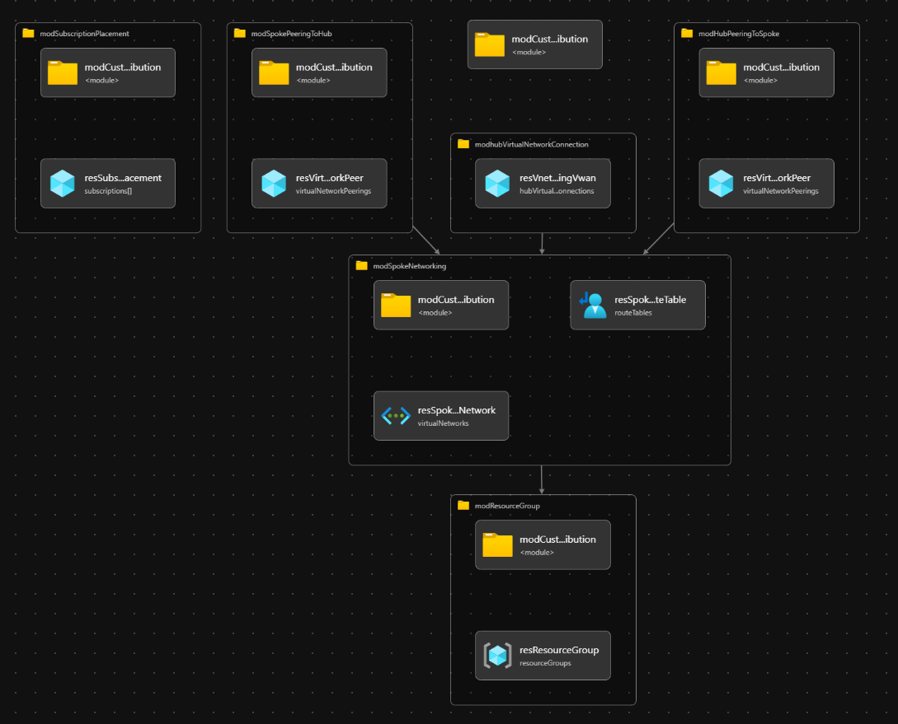

# Module: Orchestration - hubPeeredSpoke - Spoke network, including peering to Hub (Hub & Spoke or Virtual WAN)

This module acts as an orchestration module that create and configures a spoke network to deliver the Azure Landing Zone Hub & Spoke architecture, for both traditional Hub & Spoke and Virtual WAN, which is also described in the wiki on the [Deployment Flow article](https://github.com/Azure/ALZ-Bicep/wiki/DeploymentFlow).

Module deploys the following resources:

- Subscription placement in Management Group hierarchy - if parPeeredVnetSubscriptionMgPlacement is specified
- Virtual Network (Spoke VNet)
- UDR - if parNextHopIPAddress and resource id of hub virtual network object is specified
- Hub to Spoke peering - if resource id of hub virtual network object is specified in parHubVirtualNetworkID
- Spoke to hub peering - if resource id of hub virtual network object is specified in parHubVirtualNetworkID
- Spoke to virtual WAN peering - if resource id of virtual WAN hub object is specified in parHubVirtualNetworkID

Note that only one peering type can be created with this module, so either traditional Hub & Spoke OR Azure virtual WAN.

## Parameters

The module requires the following inputs:

 | Parameter                              | Type   | Default                                                         | Description                                                            | Requirement        | Example                                                                                                                                                    |
 | -------------------------------------- | ------ | --------------------------------------------------------------- | ---------------------------------------------------------------------- | ------------------ | ---------------------------------------------------------------------------------------------------------------------------------------------------------- |
 | parLocation                            | string | `deployment().location`                                       | The region to deploy all resoruces into                                | Valid Azure Region | `northeurope`                                                                                                                                              |
 | parTopLevelManagementGroupPrefix       | string | `'alz'`                                                         | Prefix for the management group hierarchy                              | None               | `alz`                                                                                                                                                      |
 | parPeeredVnetSubscriptionId            | string | Empty string `''`                                               | Subscription Id to the Virtual Network Hub object                      | None               | `xxxxxxxx-xxxx-xxxx-xxxx-xxxxxxxxxxxx`                                                                                                                     |
 | parTags                                | object | Empty object `{}`                                               | Array of Tags to be applied to all resources in module                 | None               | `{"key": "value"}`                                                                                                                                         |
 | parTelemetryOptOut                     | bool   | false                                                           | Set Parameter to true to Opt-out of deployment telemetry               | None               | false                                                                                                                                                      |
 | parPeeredVnetSubscriptionMgPlacement   | string | Empty string `''`                                               | The location (MG hierarchy) to place the subscription in               | None               | `'alz-platform-landingZonesCorp'`                                                              |
 | parResourceGroupNameForSpokeNetworking | string | `$parTopLevelManagementGroupPrefix-$parRegion-spoke-networking` | Name of Resource Group to be created to contain resources              | None               | `Hub_Networking_POC`                                                                                                                                       |
 | parDdosProtectionPlanId                | string | Empty string `''`                                               | Existing DDoS Protection plan to utilize                               | None               | `/subscriptions/xxxxxxxx-xxxx-xxxx-xxxx-xxxxxxxxxxxx/resourceGroups/Hub_Networking_POC/providers/Microsoft.Network/ddosProtectionPlans/alz-Ddos-Plan`      |
 | parSpokeNetworkName                    | string | `vnet-spoke`                                                    | The Name of the Spoke Virtual Network.                                 | None               | `vnet-spoke`                                                                                                                                               |
 | parSpokeNetworkAddressPrefix           | string | `10.11.0.0/16`                                                  | CIDR for Spoke Network                                                 | None               | `10.11.0.0/16`                                                                                                                                             |
 | parDnsServerIps                    | array  | Empty array `[]`                                                | Array IP DNS Servers to use for VNet DNS Resolution                    | None               | `['10.10.1.4', '10.20.1.5']`                                                                                                                               |
 | parNextHopIpAddress                    | string | Empty string `''`                                               | IP Address where network traffic should route to                       | None               | `192.168.50.4`                                                                                                                                             |
 | parDisableBgpRoutePropagation                 | bool   | false                                                           | Switch to enable BGP Route Propagation on VNet Route Table             | None               | false                                                                                                                                                      |
 | parSpokeToHubRouteTableName            | string | 'rtb-spoke-to-hub'                                              | Name of Route table to create for the default route of Hub             | None               | `rtb-spoke-to-hub`                                                                                                                                         |
 | parHubVirtualNetworkId                 | string | Empty string `''`                                               | Virtual Network ID of Hub Virtual Network, or Azure Virtuel WAN hub ID | None               | `/subscriptions/xxxxxxxx-xxxx-xxxx-xxxx-xxxxxxxxxxxx/resourceGroups/Hub_Networking_POC/providers/Microsoft.Network/virtualNetworks/alz-vnet-hub-northeurope`  
 | parAllowSpokeForwardedTraffic          | bool   | false                                                           | Switch to enable/disable forwarded Traffic from outside spoke network  | None               | false                                                                                                                                                      |
 | parAllowHubVpnGatewayTransit           | bool   | false                                                           | Switch to enable/disable VPN Gateway for the hub network peering       | None               | false                                                                                                                                                      |

## Outputs

The module will generate the following outputs:

| Output                      | Type   | Example                                                                                                                                             |
| --------------------------- | ------ | --------------------------------------------------------------------------------------------------------------------------------------------------- |
| outSpokeVirtualNetworkName  | string | `vnet-spoke`                                                                                                                                        |
| outSpokeVirtualNetworkId    | string | `/subscriptions/xxxxxxxx-xxxx-xxxx-xxxxx-xxxxxxxxx/resourceGroups/Hub_Networking_POC/providers/Microsoft.Network/virtualNetworks/vnet-spoke`        |

## Deployment

This module is intended to be called from other modules as a reusable resource, but an example on how to deploy has been added below for completeness.

In this example, the spoke resources will be deployed to the resource group specified. According to the Azure Landing Zone Conceptual Architecture, the spoke resources should be deployed into the Landing Zones subscriptions. During the deployment step, we will take the parameters provided in the example parameter files.

> For the examples below we assume you have downloaded or cloned the Git repo as-is and are in the root of the repository as your selected directory in your terminal of choice.

### Azure CLI
```bash
# For Azure global regions
az deployment mg create \
    --template-file infra-as-code/bicep/orchestration/hubPeeredSpoke/hubPeeredSpoke.bicep \
    --parameters @infra-as-code/bicep/orchestration/hubPeeredSpoke/parameters/hubPeeredSpoke.parameters.all.json \
    --location eastus \
    --management-group-id alz
```
OR
```bash
# For Azure China regions
az deployment mg create \
    --template-file infra-as-code/bicep/orchestration/hubPeeredSpoke/hubPeeredSpoke.bicep \
    --parameters @infra-as-code/bicep/orchestration/hubPeeredSpoke/parameters/hubPeeredSpoke.parameters.all.json \
    --location chinaeast2 \
    --management-group-id alz
```

### PowerShell

```powershell
# For Azure global regions
New-AzManagementGroupDeployment `
  -TemplateFile infra-as-code/bicep/orchestration/hubPeeredSpoke/hubPeeredSpoke.bicep `
  -TemplateParameterFile infra-as-code/bicep/orchestration/hubPeeredSpoke/parameters/hubPeeredSpoke.parameters.all.json `
  -Location eastus `
  -ManagementGroupId alz
```
OR
```powershell
# For Azure China regions
New-AzManagementGroupDeployment `
  -TemplateFile infra-as-code/bicep/orchestration/hubPeeredSpoke/hubPeeredSpoke.bicep `
  -TemplateParameterFile infra-as-code/bicep/orchestration/hubPeeredSpoke/parameters/hubPeeredSpoke.parameters.all.json `
  -Location chinaeast2 `
  -ManagementGroupId alz

```

## Bicep Visualizer




