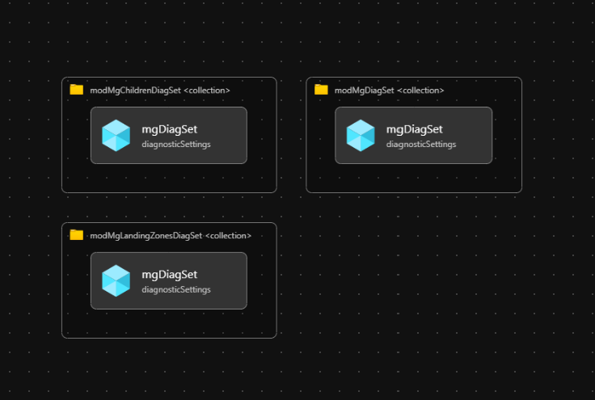

# Module: Orchestration - mgDiagSettingsAll - Enable diagnostic settings for management groups in the ALZ Management Groups hierarchy

This module acts as an orchestration module that helps enable Diagnostic Settings on the Management Group hierarchy as was defined during the deployment of the Management Group module (this can be deployed via the [`managementGroups.bicep` module](https://github.com/Azure/ALZ-Bicep/tree/main/infra-as-code/bicep/modules/managementGroups)), which is also described in the wiki on the [Deployment Flow article](https://github.com/Azure/ALZ-Bicep/wiki/DeploymentFlow).

This is accomplished through a managementGroup-scoped Azure Resource Manager (ARM) deployment. There are two boolean parameters that should match the options selected during the deployment of Management Group module regarding creation or not of Corp and Online Landing Zones and Confidential Corp and Confidential Online Landing zones.
It also enables Diagnostic Settings for existing custom child landing zones if those are specified.


> This module calls the [`mgDiagSettings.bicep`](https://github.com/Azure/ALZ-Bicep/tree/main/infra-as-code/bicep/modules/mgDiagSettings) module multiple times to enable Diagnostic Settings to the desired Management Groups. If you only want to enable Diagnostic Settings at a time to a specified Management Group, then you could consider using the child module directly.

## Parameters

The module requires the following inputs:

| Parameter                             | Type   | Description                                                                                                                                                                          | Requirements                      | Example                                                                                 |
| ------------------------------------- | ------ | ------------------------------------------------------------------------------------------------------------------------------------------------------------------------------------ | --------------------------------- | --------------------------------------------------------------------------------------- |
| parTopLevelManagementGroupPrefix      | string | Prefix for the management group hierarchy.  This management group will be created as part of the deployment.                                                                         | 2-10 characters                   | `alz`                                                                                   |
| parLandingZoneMgAlzDefaultsEnable     | bool   | Deploys Corp & Online Management Groups beneath Landing Zones Management Group if set to true.                                                                                       | Mandatory input, default: `true`  | `true`                                                                                  |
| parLandingZoneMgConfidentialEnable    | bool   | Deploys Confidential Corp & Confidential Online Management Groups beneath Landing Zones Management Group if set to true.                                                             | Mandatory input, default: `false` | `false`                                                                                 |
| parLogAnalyticsWorkspaceResourceId | string   | Resource ID of the Log Analytics Workspace                                                             | Mandatory input | `/subscriptions/xxxxxxxx-xxxx-xxxx-xxxx-xxxxxxxxxxxx/resourceGroups/alz-logging/providers/Microsoft.OperationalInsights/workspaces/alz-log-analytics` |
| parLandingZoneMgChildren              | array | Dictionary Object to allow additional child Management Groups of Landing Zones Management Group to be deployed.                                                         | Not required input, default `[]`  | {"value": ["pci","avs"]}                                                         |
| parTelemetryOptOut                    | bool   | Set Parameter to true to Opt-out of deployment telemetry                                                                                                                             | Mandatory input, default: `false` | `false`                                                                                 |

### Diagnostic Settings for Child Landing Zone Management Groups

This module considers the same flexibility used when creating the child Landing Zone Management Groups during deployment of the Management Groups module. The three parameters detailed below should correspond to the values used during Management Groups module deployment. All of these parameters can be used together to enable diagnostic settings on the child Landing Zone Management Groups.

- `parLandingZoneMgAlzDefaultsEnable`
  - Boolean - defaults to `true`
  - **Required**
  - Deploys following child Landing Zone Management groups if set to `true`:
    - `Corp`
    - `Online`
    - *These are the default ALZ Management Groups as per the conceptual architecture*
- `parLandingZoneMgConfidentialEnable`
  - Boolean - defaults to `false`
  - **Required**
  - Deploys following child Landing Zone Management groups if set to `true`:
    - `Confidential Corp`
    - `Confidential Online`
- `parLandingZoneMgChildren`
  - Object - default is an empty array `[]`
  - **Optional**
  - Deploys whatever you specify in the object as child Landing Zone Management groups.

#### `parLandingZoneMgChildren` Input Examples

Below are some examples of how to use this input parameter in both Bicep & JSON formats.

##### Bicep Example

```bicep
parLandingZoneMgChildren: {
  pci: {
    displayName: 'PCI'
  }
  'another-example': {
    displayName: 'Another Example'
  }
}
```

##### JSON Parameter File Input Example

```json
    "parLandingZoneMgChildren": {
      "value": [
        "pci",
        "another-example"
    ]
  }
```

## Outputs

*The module will not generate any outputs.*

## Deployment

In this example, the Diagnostic Settings are enabled on the management groups through a managementGroup-scoped deployment.

> For the examples below we assume you have downloaded or cloned the Git repo as-is and are in the root of the repository as your selected directory in your terminal of choice.

### Azure CLI

```bash
# For Azure global regions
az deployment mg create \
  --template-file infra-as-code/bicep/orchestration/mgDiagSettingsAll/mgDiagSettingsAll.bicep \
  --parameters @infra-as-code/bicep/orchestration/mgDiagSettingsAll/parameters/mgDiagSettingsAll.parameters.all.json \
  --location eastus \
  --management-group-id alz
```

OR

```bash
# For Azure China regions
az deployment mg create \
  --template-file infra-as-code/bicep/orchestration/mgDiagSettingsAll/mgDiagSettingsAll.bicep \
  --parameters @infra-as-code/bicep/orchestration/mgDiagSettingsAll/parameters/mgDiagSettingsAll.parameters.all.json \
  --location chinaeast2 \
  --management-group-id alz
```

### PowerShell

```powershell
# For Azure global regions
New-AzManagementGroupDeployment `
  -TemplateFile infra-as-code/bicep/orchestration/mgDiagSettingsAll/mgDiagSettingsAll.bicep `
  -TemplateParameterFile infra-as-code/bicep/orchestration/mgDiagSettingsAll/parameters/mgDiagSettingsAll.parameters.all.json `
  -Location eastus `
  -ManagementGroupId alz

```

OR

```powershell
# For Azure China regions
New-AzManagementGroupDeployment `
  -TemplateFile infra-as-code/bicep/orchestration/mgDiagSettingsAll/mgDiagSettingsAll.bicep `
  -TemplateParameterFile infra-as-code/bicep/orchestration/mgDiagSettingsAll/parameters/mgDiagSettingsAll.parameters.all.json `
  -Location chinaeast2 `
  -ManagementGroupId alz

```

## Validation

To validate if Diagnostic Settings was correctly enabled for any specific management group, a REST API GET call can be used. Documentation and easy way to try this can be found in this link [(Management Group Diagnostic Settings - Get)](https://learn.microsoft.com/rest/api/monitor/management-group-diagnostic-settings/get?tabs=HTTP&tryIt=true&source=docs#code-try-0). There is currently not a direct way to validate this in the Azure Portal, Azure CLI or PowerShell.

## Bicep Visualizer


