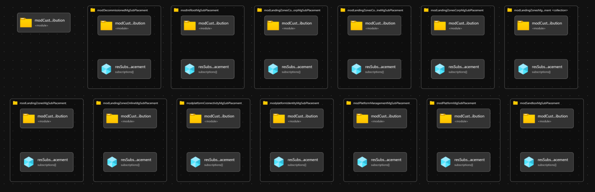

# Module: Orchestration - subPlacementAll - Place All Subscriptions Into ALZ Management Group Hierarchy

This module acts as an orchestration module that helps to define where all Subscriptions should be placed in the ALZ Management Group Hierarchy (this can be deployed via the [`managementGroups.bicep` module](https://github.com/Azure/ALZ-Bicep/tree/main/infra-as-code/bicep/modules/managementGroups)), which is also described in the wiki on the [Deployment Flow article](https://github.com/Azure/ALZ-Bicep/wiki/DeploymentFlow).

Module deploys the following resources:

- Subscription placement for multiple Subscriptions into the ALZ Management Group hierarchy

> This module calls the [`subscriptionPlacement.bicep` module](https://github.com/Azure/ALZ-Bicep/tree/main/infra-as-code/bicep/modules/subscriptionPlacement) multiple times to move the specified Subscription IDs to the desired Management Groups. If you only want to move a single subscription at a time to a specified Management Group, then you could consider this child module that is called many times in this module.

## Parameters

- [Parameters for Azure Commercial Cloud](generateddocs/subPlacementAll.bicep.md)

### `parLandingZoneMgChildrenSubs` and `parPlatformMgChildrenSubs` Input Examples

The `parLandingZoneMgChildrenSubs` and `parPlatformMgChildrenSubs` are only used if you have deployed different Management Groups beneath the Landing Zones and Platform Management Group using the `parLandingZoneMgChildren` and/or `parPlatformMgChildren` parameter in the [`managementGroups.bicep` module](https://github.com/Azure/ALZ-Bicep/tree/main/infra-as-code/bicep/modules/managementGroups).

Below are some examples of how to use these input parameters in both Bicep & JSON formats.

> **NOTE:** The keys of each object in the dictionary object only need to match the last part of the Management Group ID, as the concatenation of the rest of the Management Group ID is automatically handled in the module.
> For Example:
> Entering `pci` as a key will match the Management Group ID of `alz-landingzones-pci` (`alz` is provided via the `parTopLevelManagementGroupPrefix` parameter). The bicep snippet for this concatenation for the Management Group ID is: `${parTopLevelManagementGroupPrefix}-landingzones-${mg.key}` (`mg` is the reference to the iterator in the loop that the module creates)

#### Bicep Example

```bicep
parLandingZoneMgChildrenSubs: {
    pci: {
      subscriptions: [
        'xxxxxxxx-xxxx-xxxx-xxxx-xxxxxxxxxxxx'
        'yyyyyyyy-yyyy-yyyy-yyyy-yyyyyyyyyyyy'
      ]
    }
    'another-example': {
      subscriptions: [
        'zzzzzzzz-zzzz-zzzz-zzzz-zzzzzzzzzzzz'
      ]
    }
}
parPlatformMgChildrenSubs: {
    security: {
      subscriptions: [
        'xxxxxxxx-xxxx-xxxx-xxxx-xxxxxxxxxxxx'
        'yyyyyyyy-yyyy-yyyy-yyyy-yyyyyyyyyyyy'
      ]
    }
    'yet-another-example': {
      subscriptions: [
        'zzzzzzzz-zzzz-zzzz-zzzz-zzzzzzzzzzzz'
      ]
    }
}
```

#### JSON Parameter File Input Example

```json
"parLandingZoneMgChildrenSubs": {
  "value": {
      "pci": {
        "subscriptions": [
          "xxxxxxxx-xxxx-xxxx-xxxx-xxxxxxxxxxxx",
          "yyyyyyyy-yyyy-yyyy-yyyy-yyyyyyyyyyyy"
        ]
      },
      "another-example": {
        "subscriptions": [
          "zzzzzzzz-zzzz-zzzz-zzzz-zzzzzzzzzzzz"
        ]
      }
  }
},
"parPlatformMgChildrenSubs": {
  "value": {
      "security": {
        "subscriptions": [
          "xxxxxxxx-xxxx-xxxx-xxxx-xxxxxxxxxxxx",
          "yyyyyyyy-yyyy-yyyy-yyyy-yyyyyyyyyyyy"
        ]
      },
      "yet-another-example": {
        "subscriptions": [
          "zzzzzzzz-zzzz-zzzz-zzzz-zzzzzzzzzzzz"
        ]
      }
  }
}
```

## Outputs

This module will **not** generate any outputs.

## Deployment

This module is intended to be used/called only once in a setup, but is likely to be ran/deployed multiple times of the lifetime of you ALZ environment; for example when a new Landing Zone Subscription is created and needs to be placed into the desired Management Group.

This however may be done as part of another process, for example upon Subscription vending. For this reason the module will not move/touch any subscriptions that are not declared in its parameters by design.

> For the examples below we assume you have downloaded or cloned the Git repo as-is and are in the root of the repository as your selected directory in your terminal of choice.

### Azure CLI
```bash
# For Azure global regions

dateYMD=$(date +%Y%m%dT%H%M%S%NZ)
NAME="alz-SubPlacementAll-${dateYMD}"
LOCATION="eastus"
MGID="alz"
TEMPLATEFILE="infra-as-code/bicep/orchestration/subPlacementAll/subPlacementAll.bicep"
PARAMETERS="@infra-as-code/bicep/orchestration/subPlacementAll/parameters/subPlacementAll.parameters.all.json"

az deployment mg create --name ${NAME:0:63} --location $LOCATION --management-group-id $MGID --template-file $TEMPLATEFILE --parameters $PARAMETERS
```

OR

```bash
# For Azure China regions

dateYMD=$(date +%Y%m%dT%H%M%S%NZ)
NAME="alz-SubPlacementAll-${dateYMD}"
LOCATION="chinaeast2"
MGID="alz"
TEMPLATEFILE="infra-as-code/bicep/orchestration/subPlacementAll/subPlacementAll.bicep"
PARAMETERS="@infra-as-code/bicep/orchestration/subPlacementAll/parameters/subPlacementAll.parameters.all.json"

az deployment mg create --name ${NAME:0:63} --location $LOCATION --management-group-id $MGID --template-file $TEMPLATEFILE --parameters $PARAMETERS
```

### PowerShell

```powershell
# For Azure global regions

$inputObject = @{
  DeploymentName        = 'alz-SubPlacementAll-{0}' -f (-join (Get-Date -Format 'yyyyMMddTHHMMssffffZ')[0..63])
  Location              = 'EastUS'
  ManagementGroupId     = 'alz'
  TemplateFile          = "infra-as-code/bicep/orchestration/subPlacementAll/subPlacementAll.bicep"
  TemplateParameterFile = 'infra-as-code/bicep/orchestration/subPlacementAll/parameters/subPlacementAll.parameters.all.json'
}

New-AzManagementGroupDeployment @inputObject
```

OR

```powershell
# For Azure China regions

$inputObject = @{
  DeploymentName        = 'alz-SubPlacementAll-{0}' -f (-join (Get-Date -Format 'yyyyMMddTHHMMssffffZ')[0..63])
  Location              = 'chinaeast2'
  ManagementGroupId     = 'alz'
  TemplateFile          = "infra-as-code/bicep/orchestration/subPlacementAll/subPlacementAll.bicep"
  TemplateParameterFile = 'infra-as-code/bicep/orchestration/subPlacementAll/parameters/subPlacementAll.parameters.all.json'
}

New-AzManagementGroupDeployment @inputObject
```

## Bicep Visualizer


